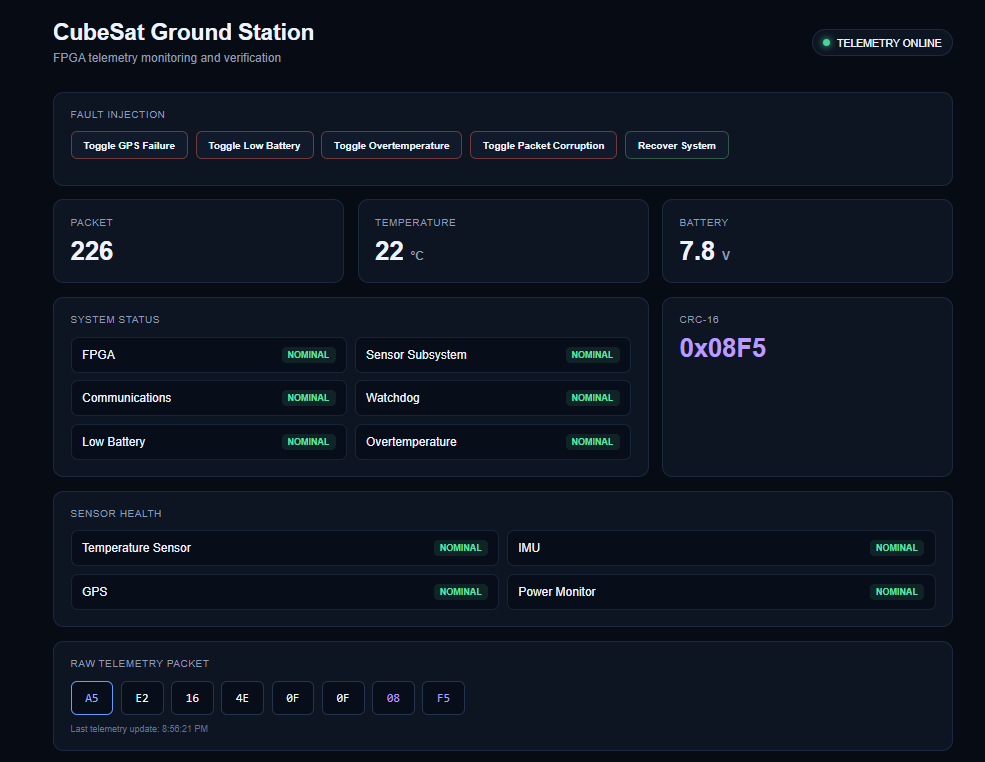
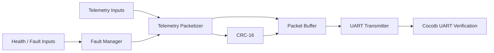
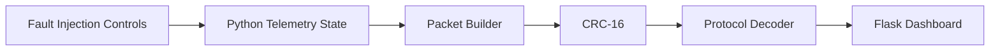
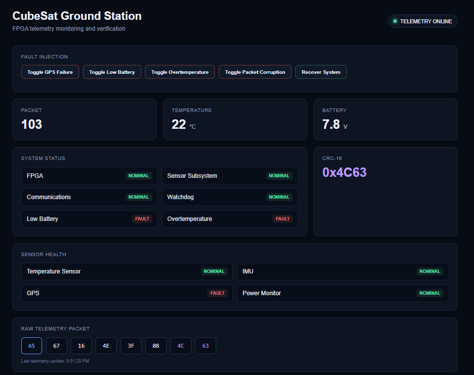
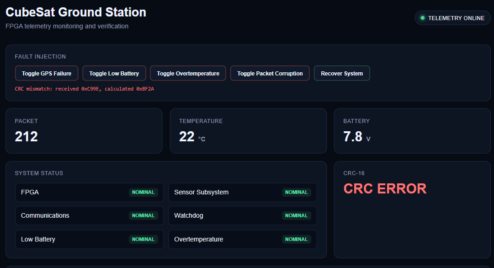
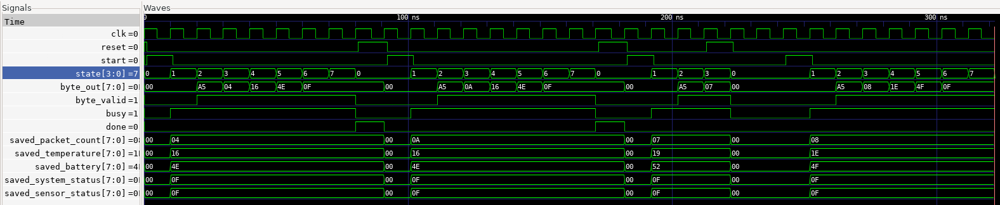

# FPGA Telemetry System

[](https://github.com/crimsix-7/fpga-telemetry-system/actions/workflows/verification.yml)

A simulated FPGA-based telemetry and fault-monitoring system built with **Verilog, cocotb, Verilator, Python, and Flask**.

## Project Scope

This project focuses on the design and verification of a modular digital telemetry system using FPGA-oriented RTL and supporting software. It demonstrates packet-based communication, CRC error detection, UART serialization, system-health monitoring, fault injection, automated verification, and ground-side telemetry visualization.

The architecture uses a spacecraft-style telemetry scenario to provide a realistic systems-engineering context, while the underlying concepts are applicable to embedded systems, robotics, industrial monitoring, autonomous platforms, IoT devices, and other reliability-focused digital systems.

<p align="center">
  
</p>

## What the Project Demonstrates

- Verilog RTL and finite-state-machine design
- Fixed-format telemetry packetization
- Input snapshotting for consistent packet generation
- CRC-16/CCITT-FALSE generation and validation
- UART 8-N-1 serialization
- System and sensor health bit-field encoding
- Fault injection and recovery behavior
- Cocotb + Verilator RTL verification
- GTKWave waveform inspection
- Python packet decoding and CRC validation
- Flask-based telemetry visualization
- Automated regression testing
- GitHub Actions continuous integration

## System Architecture

The project contains two related execution paths using the same telemetry format and CRC rules.

### RTL Telemetry Path



The RTL path captures telemetry data, generates status fields, calculates CRC protection, assembles the complete packet, and serializes it through UART.

### Ground-Station Path



The ground-station application implements the same packet format and CRC algorithm for packet decoding, validation, visualization, and interactive fault injection.

The RTL UART path is verified through cocotb integration tests, while the Flask dashboard provides a software-side demonstration of the telemetry protocol.

See [`docs/architecture.md`](docs/architecture.md) for the detailed design.

## Demonstration

The dashboard provides a visual interface for telemetry monitoring and fault simulation.

### Fault Injection

<p align="center">
  
  
</p>

The demonstration supports:

- GPS failure
- low-battery warning
- overtemperature warning
- intentional packet corruption
- CRC mismatch detection
- recovery to nominal operation

## Telemetry Packet

The protocol uses a fixed **8-byte packet**:

| Byte | Field | Description |
|---:|---|---|
| 0 | Header | Fixed synchronization byte `0xA5` |
| 1 | Packet Count | 8-bit sequence field |
| 2 | Temperature | Unsigned temperature in °C |
| 3 | Battery | Battery voltage encoded as volts × 10 |
| 4 | System Status | System-health bit field |
| 5 | Sensor Status | Sensor-health bit field |
| 6 | CRC High | Upper byte of CRC-16 |
| 7 | CRC Low | Lower byte of CRC-16 |

Example nominal packet:

```text
A5 04 16 4E 0F 0F FE 7C
```

Decoded:

```text
Packet Count:   4
Temperature:    22 °C
Battery:        7.8 V
System Status:  0x0F
Sensor Status:  0x0F
CRC-16:         0xFE7C
```

CRC is calculated over bytes `0–5` using **CRC-16/CCITT-FALSE**:

```text
Polynomial:     0x1021
Initial Value:  0xFFFF
Reference:      "123456789" → 0x29B1
```

See [`docs/telemetry_protocol.md`](docs/telemetry_protocol.md) for the complete protocol definition.

## RTL Modules

| Module | Purpose |
|---|---|
| `telemetry_packetizer.v` | Captures telemetry inputs and emits the six data bytes using an FSM |
| `crc16.v` | Implements CRC-16/CCITT-FALSE |
| `uart_tx.v` | Serializes packet bytes using UART 8-N-1 framing |
| `fault_manager.v` | Encodes system and sensor health inputs into status bytes |
| `telemetry_system.v` | Integrates packetizer, CRC, packet storage, fault manager, and UART |
| `telemetry_top.v` | Basic synchronous counter used for initial RTL verification |

## Verification

The project uses **cocotb**, **Verilator**, **pytest**, and **GTKWave** for automated and waveform-based verification.

### Packetizer Waveform

<p align="center">
  
</p>

The waveform shows the packetizer FSM progressing through each telemetry field while `byte_out` emits:

```text
A5 → 04 → 16 → 4E → 0F → 0F
```

Telemetry inputs are latched when packet generation begins and remain stable throughout the active transmission.

### Verification Coverage

The automated tests cover:

- synchronous reset and counter behavior
- telemetry packet byte ordering
- input snapshot integrity
- reset during packet generation and recovery
- CRC known-vector validation
- CRC reset behavior
- corrupted-data detection
- UART start, data, and stop framing
- LSB-first UART serialization
- nominal status encoding
- injected fault-state encoding
- complete nominal UART packet transmission
- complete fault-state UART packet transmission
- Python packet decoding
- invalid-header rejection
- corrupted-packet rejection
- FPGA/Python CRC agreement

Run the complete regression suite with:

```bash
make regression
```

The current regression suite contains **17 passing test cases**.

Detailed verification documentation:

- [`docs/verification_plan.md`](docs/verification_plan.md)
- [`docs/verification_results.md`](docs/verification_results.md)

## Ground Station

The Python ground station decodes telemetry packets, validates CRC integrity, interprets system and sensor status fields, and exposes the results through a Flask dashboard.

Install dependencies:

```bash
pip install -r requirements.txt
```

Run:

```bash
python -m ground_station.dashboard
```

Then open:

```text
http://127.0.0.1:5000
```

The dashboard displays:

- packet count
- temperature
- battery voltage
- CRC status
- system health
- sensor health
- raw telemetry bytes

Interactive controls allow faults and packet corruption to be injected for demonstration and validation.

## Project Structure

```text
fpga-telemetry-system/
├── rtl/
│   ├── crc16.v
│   ├── fault_manager.v
│   ├── telemetry_packetizer.v
│   ├── telemetry_system.v
│   ├── telemetry_top.v
│   └── uart_tx.v
│
├── tests/
│   ├── test_crc16.py
│   ├── test_fault_manager.py
│   ├── test_ground_station.py
│   ├── test_packetizer.py
│   ├── test_telemetry.py
│   ├── test_telemetry_system.py
│   └── test_uart_tx.py
│
├── ground_station/
│   ├── dashboard.py
│   ├── protocol.py
│   └── templates/
│       └── dashboard.html
│
├── docs/
│   ├── images/
│   │   ├── dashboard-nominal.png
│   │   ├── dashboard-faults.png
│   │   ├── dashboard-crc-error.png
│   │   └── packetizer-waveform.png
│   ├── architecture.md
│   ├── telemetry_protocol.md
│   ├── verification_plan.md
│   └── verification_results.md
│
├── .github/
│   └── workflows/
│       └── verification.yml
│
├── Makefile
├── pytest.ini
├── requirements.txt
└── README.md
```

## Technology

**RTL / Digital Design**

- Verilog
- finite-state machines
- UART
- CRC-16
- status bit fields

**Verification**

- cocotb
- Verilator
- GTKWave
- pytest
- Python

**Ground Software**

- Python
- Flask
- HTML
- CSS
- JavaScript

**Development**

- Linux / WSL
- Git
- GitHub Actions
- automated CI regression testing

