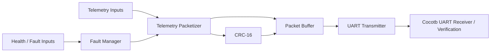
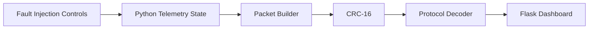

# Virtual CubeSat Avionics & Telemetry System

A simulated FPGA telemetry project that combines **Verilog RTL**, **CRC-protected packet generation**, **UART transmission**, **fault/status encoding**, **cocotb verification**, and a **Python/Flask ground-station dashboard**.

## Project Scope

This project focuses on the design and verification of a modular digital telemetry system using FPGA-oriented RTL and supporting software. It demonstrates packet-based communication, CRC error detection, UART serialization, system-health monitoring, fault injection, automated verification, and ground-side telemetry visualization.

The architecture uses a spacecraft-style telemetry scenario to provide a realistic systems-engineering context, but the underlying concepts are applicable to embedded systems, robotics, industrial monitoring, autonomous platforms, IoT devices, and other reliability-focused digital systems.

## What the Project Demonstrates

- Verilog RTL and finite-state-machine design
- Fixed-format telemetry packetization
- Snapshotting of input data at packet start
- CRC-16/CCITT-FALSE generation and error detection
- UART 8-N-1 serialization
- System and sensor health bit fields
- Fault injection and recovery behavior
- Cocotb + Verilator RTL verification
- GTKWave waveform inspection
- Python packet decoding and CRC validation
- Flask-based telemetry visualization
- Automated regression testing
- GitHub Actions workflow for CI

## System Architecture

The project has two related execution paths that share the same telemetry format and CRC rules.

### RTL path



### Ground-station demonstration path



> **Scope note:** the Flask dashboard currently demonstrates ground-side packet generation, decoding, CRC checking, and fault visualization using the same protocol as the RTL. It does **not** yet consume the Verilator UART stream in real time. The RTL UART path is verified separately through cocotb integration tests.

See [`docs/architecture.md`](docs/architecture.md) for the detailed design.

## Telemetry Packet

The protocol uses a fixed 8-byte packet:

| Byte | Field | Description |
|---:|---|---|
| 0 | Header | Fixed synchronization byte `0xA5` |
| 1 | Packet Count | 8-bit sequence field |
| 2 | Temperature | Unsigned temperature in °C |
| 3 | Battery | Battery voltage encoded as volts × 10 |
| 4 | System Status | System-health bit field |
| 5 | Sensor Status | Sensor-health bit field |
| 6 | CRC High | Upper byte of CRC-16 |
| 7 | CRC Low | Lower byte of CRC-16 |

Example nominal packet:

```text
A5 04 16 4E 0F 0F FE 7C
```

This represents packet `4`, temperature `22 °C`, battery `7.8 V`, nominal system/sensor status, and CRC `0xFE7C`.

See [`docs/telemetry_protocol.md`](docs/telemetry_protocol.md) for the exact field definitions and CRC parameters.

## RTL Modules

| Module | Purpose |
|---|---|
| `telemetry_packetizer.v` | Captures telemetry inputs and emits the six data bytes using an FSM |
| `crc16.v` | Implements CRC-16/CCITT-FALSE |
| `uart_tx.v` | Serializes bytes using UART 8-N-1 framing |
| `fault_manager.v` | Encodes system and sensor health inputs into status bytes |
| `telemetry_system.v` | Integrates packetizer, CRC, packet storage, fault manager, and UART |
| `telemetry_top.v` | Initial counter module retained as a basic RTL verification exercise |

## Verification

The project uses **cocotb**, **Verilator**, **pytest**, and **GTKWave**.

The regression suite covers:

- basic synchronous RTL behavior
- packet byte ordering
- telemetry snapshot integrity
- reset during packet generation and recovery
- CRC known-vector validation
- CRC corruption detection
- UART start/data/stop framing
- status-bit encoding
- nominal integrated telemetry transmission
- injected fault-state transmission
- Python packet decoding
- invalid-header rejection
- corrupted-packet rejection

Run all tests with:

```bash
make regression
```

The current local regression completes successfully across **17 test cases**.

Verification details:

- [`docs/verification_plan.md`](docs/verification_plan.md)
- [`docs/verification_results.md`](docs/verification_results.md)

## Ground Station

Install dependencies:

```bash
pip install -r requirements.txt
```

Run the dashboard:

```bash
python -m ground_station.dashboard
```

Open:

```text
http://127.0.0.1:5000
```

The dashboard displays packet count, temperature, battery voltage, CRC status, system health, and sensor health. It also supports interactive GPS failure, low-battery, overtemperature, packet-corruption, and recovery demonstrations.

## Project Structure

```text
virtual-cubesat/
├── rtl/
│   ├── crc16.v
│   ├── fault_manager.v
│   ├── telemetry_packetizer.v
│   ├── telemetry_system.v
│   ├── telemetry_top.v
│   └── uart_tx.v
├── tests/
│   ├── test_crc16.py
│   ├── test_fault_manager.py
│   ├── test_ground_station.py
│   ├── test_packetizer.py
│   ├── test_telemetry.py
│   ├── test_telemetry_system.py
│   └── test_uart_tx.py
├── ground_station/
│   ├── dashboard.py
│   ├── protocol.py
│   └── templates/
│       └── dashboard.html
├── docs/
│   ├── architecture.md
│   ├── telemetry_protocol.md
│   ├── verification_plan.md
│   └── verification_results.md
├── .github/workflows/
│   └── verification.yml
├── Makefile
├── pytest.ini
├── requirements.txt
└── README.md
```

## Technology

**RTL:** Verilog, FSMs, UART, CRC-16, status bit fields  
**Verification:** cocotb, Verilator, GTKWave, pytest  
**Ground software:** Python, Flask, HTML, CSS, JavaScript  
**Development:** Linux/WSL, Git, GitHub Actions

