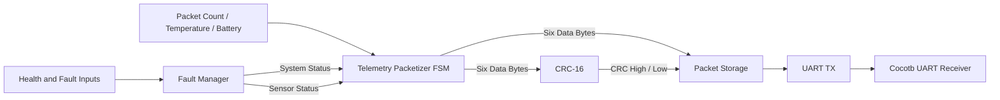
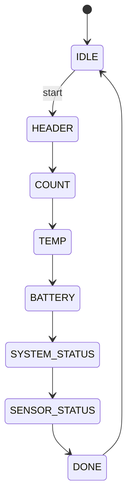
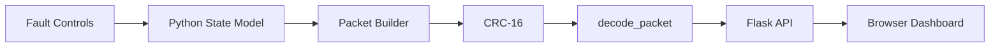

# System Architecture

## Purpose

The system models a small digital telemetry chain with explicit interfaces between telemetry inputs, health/status logic, packet generation, error detection, serialization, verification, and ground-side visualization.

## RTL Architecture

### Data flow

1. `fault_manager.v` converts boolean health/fault inputs into two 8-bit status fields.
2. `telemetry_packetizer.v` snapshots the packet count, temperature, battery, and status bytes when `start` is accepted.
3. The packetizer emits six bytes in protocol order.
4. `crc16.v` calculates CRC-16/CCITT-FALSE across those six bytes.
5. `telemetry_system.v` stores the six payload bytes and appends the two CRC bytes.
6. `uart_tx.v` serializes all eight bytes using UART framing.
7. Cocotb receives and reconstructs the UART stream during integration verification.

## Packetizer FSM

The telemetry inputs are latched at packet start. This prevents live input changes from producing a packet containing values from different sampling instants.

## UART Interface

The simulated UART transmitter uses:

- idle HIGH
- one start bit
- eight data bits
- LSB-first data order
- no parity
- one stop bit

The integration configuration uses `CLKS_PER_BIT = 4` to keep simulation time short. It is a simulation timing parameter, not a claimed physical baud rate.

## Fault and Status Path

`fault_manager.v` encodes:

**System status**

- FPGA healthy
- sensor subsystem healthy
- communications healthy
- watchdog active
- low-battery warning
- overtemperature warning

**Sensor status**

- temperature sensor healthy
- IMU healthy
- GPS healthy
- power monitor healthy

These two bytes are included in the CRC-protected telemetry payload.

## Ground-Station Architecture

`ground_station/protocol.py` implements the same packet layout and CRC rules used by the RTL verification environment.

The dashboard intentionally corrupts selected packet data **after** CRC generation when packet-corruption mode is enabled. The decoder then recalculates the CRC and reports the mismatch.

## Current Integration Boundary

The RTL telemetry chain and the Flask dashboard are verified against the same protocol, but they are not currently connected as one live process.

- The **RTL path** is exercised end-to-end through UART in cocotb.
- The **dashboard path** uses a Python packet model and the shared protocol decoder for visualization and fault injection.

A future extension could bridge UART bytes from the simulator into the dashboard process.
